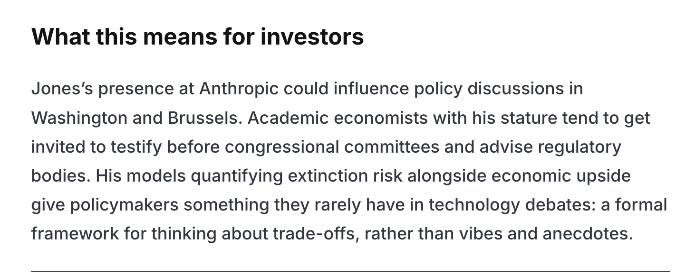
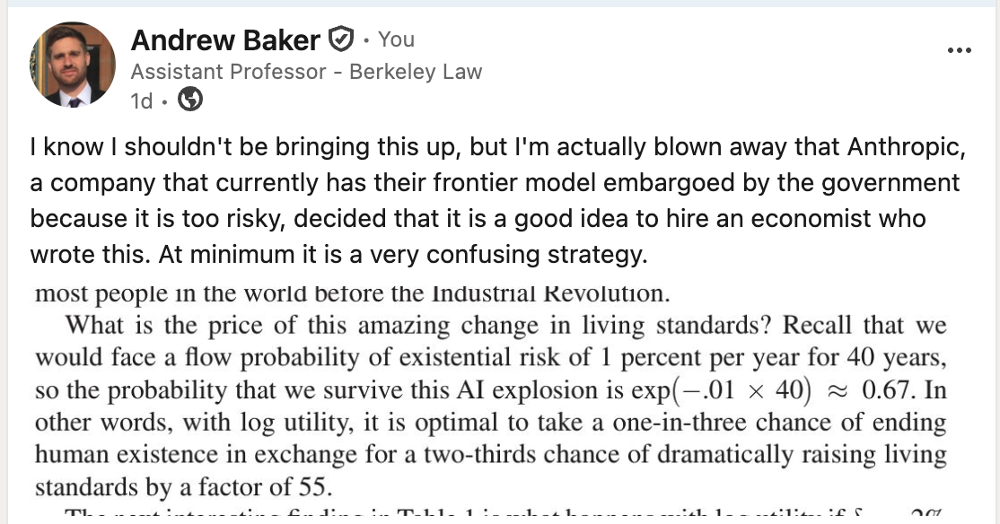
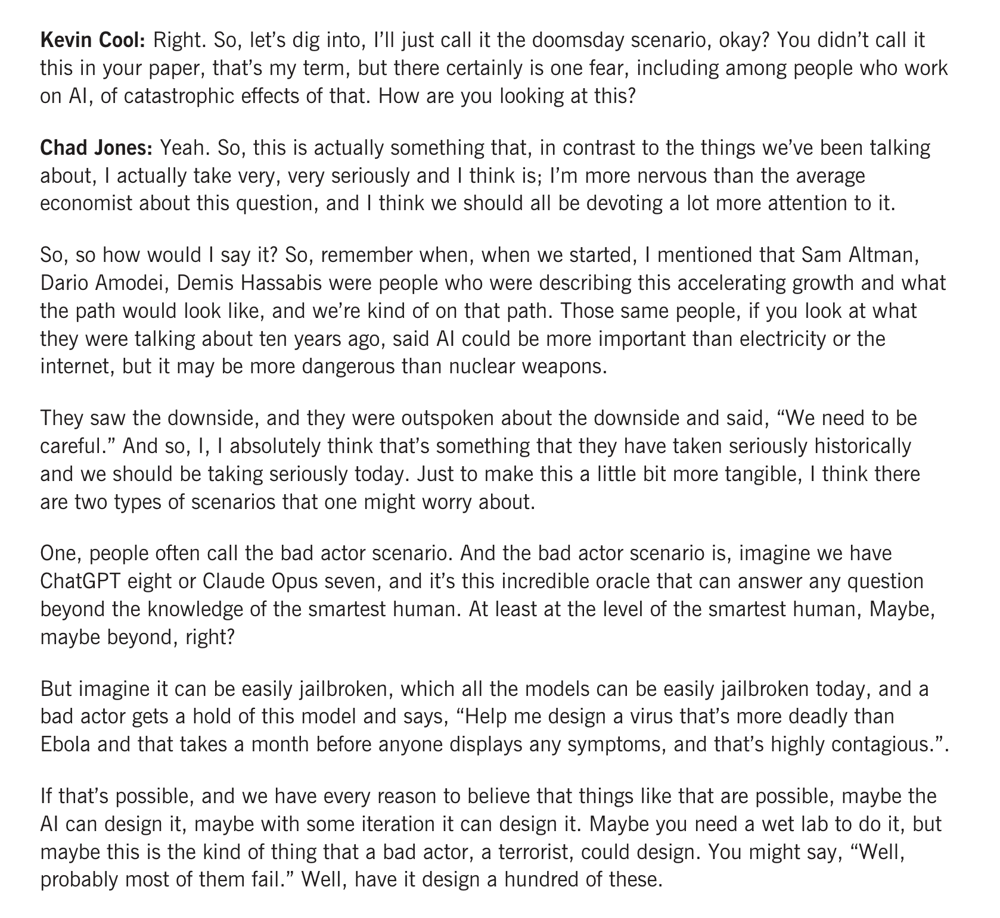
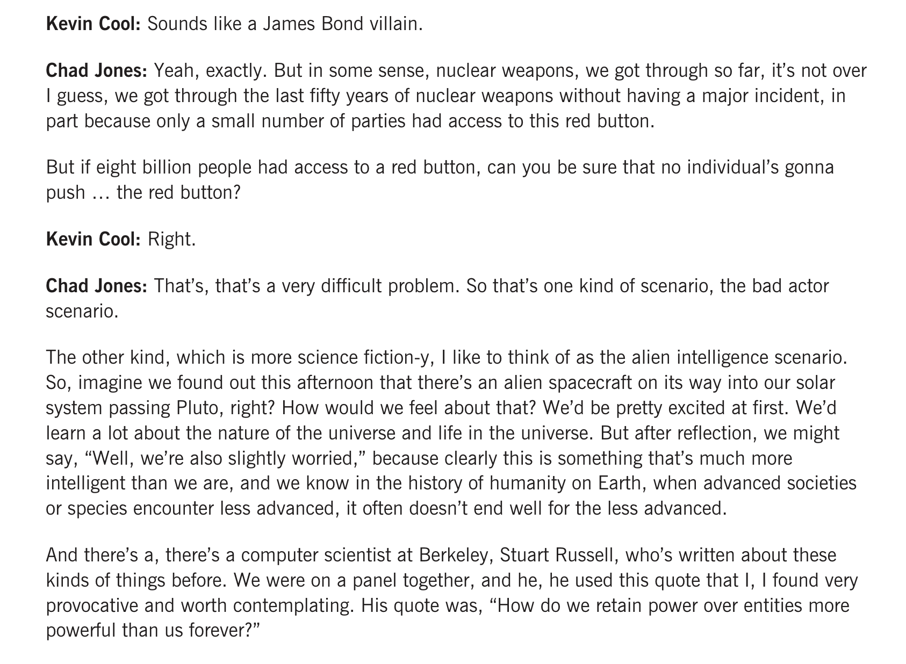
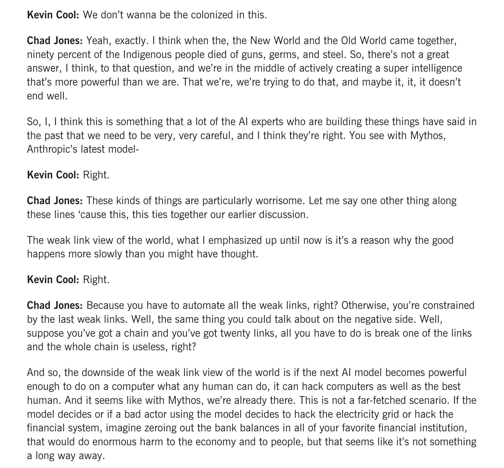
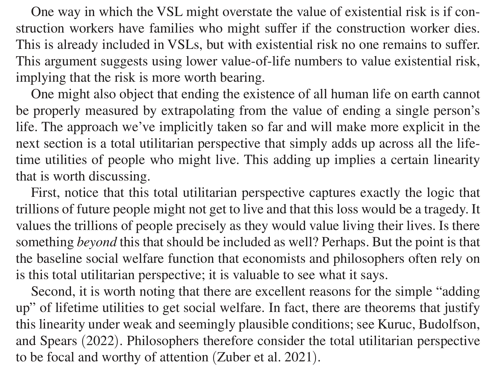

# Setting

Recently, Anthropic hired Chad Jones to join the [Anthropic Institute](https://www.anthropic.com/institute). (Side note - although I got my PhD at Stanford GSB I never met him, and from everything I have heard he is a very nice and smart person.) A [blog post](https://cryptobriefing.com/anthropic-hires-chad-jones-ai-risks/) notes the hire was likely driven by his work on the tradeoff between AI innovation and existential risks. The post goes on to state:

{width="80%," fig-align="center"}

I shot off a post on LinkedIn arguing that this hire didn't make a ton of sense to me.

{width="80%," fig-align="center"}

My post was then picked up by the FT in an [article](https://www.ft.com/content/bb04671c-4377-4231-96ef-0f8e57ed5d1b), and led to many heated text messages. In this blog post I'll clarify my issue here.

# Governance Puzzle

As reflected in my post, I'm primarily confused by the strategy here from Anthropic. I study corporate governance and how firms signal to the market, and I thought this was a weird hire for obvious reasons.

As most people probably know, the federal government recently forced Anthropic to take its leading Mythos model off the market due to safety concerns. According to [The Verge](https://www.theverge.com/ai-artificial-intelligence/957327/anthropic-mythos-fable-ai-trump-administration-negotiations), "The company sprang into action immediately, sending a barrage of executives to Washington, DC. But updates have been suspiciously lacking, with no resolution in sight." The article goes on to further explain that "Anthropic needs the revenue from Mythos to pay for all the compute it's secured recently, including a deal to pay SpaceX \$15 billion per year for access to its data centers, as well as its public image before the IPO. Two of Anthropic's largest current shareholders --- Google and Amazon --- have tried to carefully stay on Trump's good side, so they're likely not happy either."

From my perspective, it is odd for a company trying to convince the government that they don't pose unnecessary safety risks to do this hire at this time. I'm not even saying it's *bad* that they made the hire, but that it's puzzling from a corporate governance perspective. Here is Chad in his own words discussing existential risk and Mythos in an [interview](https://www.gsb.stanford.edu/insights/ai-future-abundance-apocalypse) (I'm doing long excerpts to not be accused of misrepresenting his views):

{width="80%," fig-align="center"} {width="80%," fig-align="center"} {width="80%," fig-align="center"}

It's an interesting interview, and he comes off as well-informed and thoughtful. Having said that, were I holding valuable private placement shares at Anthropic, I wouldn't be happy about their new hire arguing that Mythos may be pushing the world to the "already there" point of doing "enormous harm to the economy and to people." Coupled with his toy model showing how the implied tradeoff from classical economic models might allow a good deal of risk seeking over extinction with standard utility functions, it didn't make a ton of sense to me if your message is supposed to be "nothing to worry about here because of us".

# The Merits

Moving on from my confusion over the corporate governance/strategy play, let's (very briefly) touch on the merits of his argument. I want to clarify a couple things at the outset. Again, from everything that I've heard from people who know him, Chad is a great economist, solid mentor/advisor, good person. I think what he did was take a simple model and show how the tradeoffs play out within a standard economic framework.

My argument isn't against this paper per se. As Chad notes, "The goal of the paper is not to provide an exact answer to this question, as the answer will surely depend on parameters that we cannot precisely quantify. Instead, the paper develops some simple models to elucidate the economic forces that are involved." I just don't think that it is a question merely of the parameters chosen, but demonstrative of the limitations of the framework itself.

I have long argued, privately and publicly, that the economic utilitarian framework for doing welfare analysis has severe limitations, which are usually acknowledged and hand-waived away. A friend and colleague accused me of "anti-intellectualism" on this today, which I disagree with, so let me briefly lay out my claim.

Under the hood of this model is a need to map choices to utils, and this gets done by plugging in a value of a statistical life. We use compensating differentials (e.g. how much more do you have to get paid to work at Plant A over Plant B to compensate you for the increased fatality rate at Plant A) to impute how much folks implicitly value their life. We then use that number to calculate costs and benefits of e.g. proposed regulations. This is also central to the innovation / risk tradeoff in this paper.

First, I don't think people generally make this tradeoff either implicitly or explicitly when doing tasks like choosing a career. Sure, it gives you *a* number, but not necessarily a number that you would want to use for calculating tradeoffs. Moreover, it is not clear why, even if this were a good measure of how someone values their own life, it should be how a social planner (standing in for society) need value said person's life. None of this is new or novel, and in addition to VSL there is longstanding philosophical work noting the limitations to pure utilitarianism. Chad understands these arguments, and briefly discusses them in his Discussion section:

{width="80%," fig-align="center"}

While philosophers may consider the total utilitarian perspective worthy of attention, I'm pretty sure it is not the dominant philosophical paradigm for thinking through such choices today.

The frequent retort is that "it takes a model to beat a model" and that, even if VSL is flawed, what is the alternative? My view, which may be anti-intellectual, is to acknowledge the difficulty of the question, and that the answer cannot and will not ever be reduced to plugging in numbers to a social planner function. These are moral considerations that require society to decide how tradeoffs can and should be made, while accepting deep uncertainty and often intractable moral considerations.

To put it more simply, the standard economic approach, despite being a "formal framework" doesn't provide more than the "vibes and anecdotes" that our policymakers currently receive. While economists frequently argue that they are alone in seriously thinking about tradeoffs, this isn't true in my experience. People make tradeoffs all the time without having to reduce the question to a single dimension.

# In Conclusion

I'm probably sorry to have kick-started this discussion, but maybe it will prove fruitful.

In the paper a social planner with log utility would exchange a 1/3 risk of extinction for 55 factor increase in consumption, which Chad finds to be "remarkably unconcerned with existential risk." Models with bounded "standard utility functions \[that\] we use frequently in a variety of applications in economics" are more conservative with regards to existential risk. The model is then "extended to include a richer theory of dynamics, the possibility of singularity, and the prospect that AI innovations extend life expectancy." If AI also extends life expectancy, or makes gains "in the same units", we avoid the need to deal with the thorny issue of converting lives to dollars. 

Here, even with "with a future-oriented focus that comes from low discounting, AI-induced mortality reductions **can make large existential risks bearable.**" While I acknowledge that society always contains some level of risk, and that progress requires acknowledging inherent tradeoffs with safety, I find it impossible to justify accepting "large existential risks" to the only sentient life in the known universe.

I also think it is important to situate this discussion within the current debate. As the paper notes, "\[a\] substantial contingent of the AI community, including leading researchers at OpenAI and Google, warn that these advances could constitute an existential risk for humanity." Despite these concerns, the leading hyperscalars are all competing to achieve the singularity. While I believe that everything in the paper is perfectly acceptable for academic work, and worthy of academic debate, I am concerned about what it means for society to have these justifications for bearing extinction risk coming from the companies creating and profiting from the risk.
