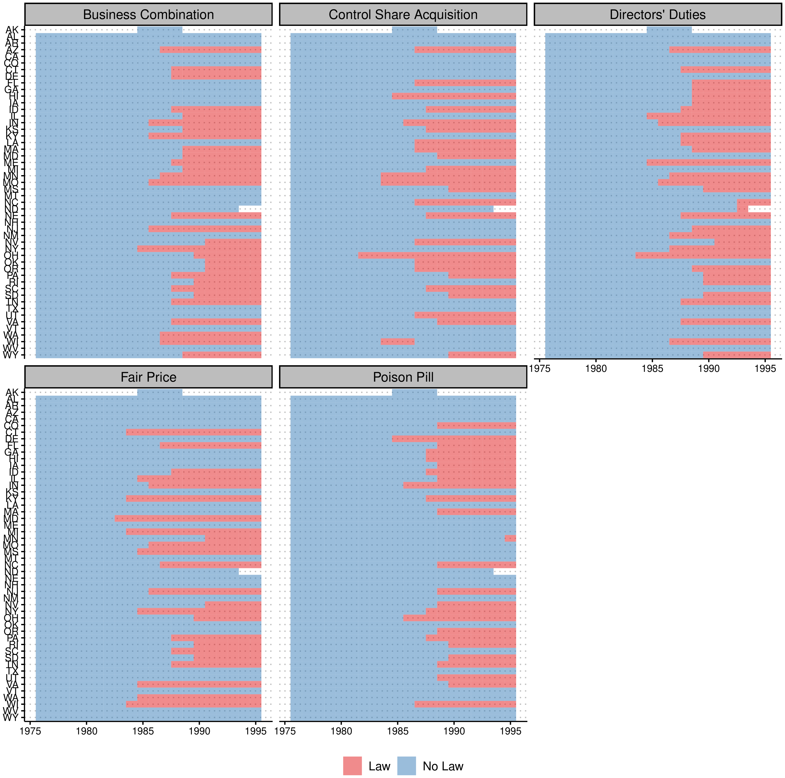
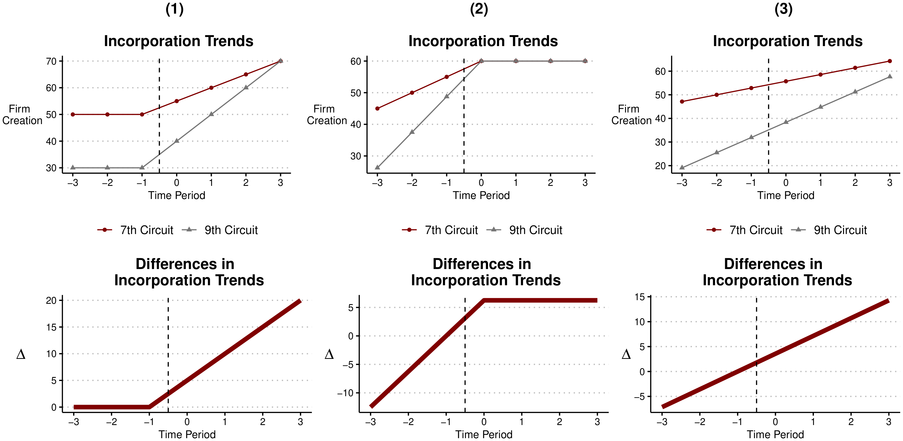
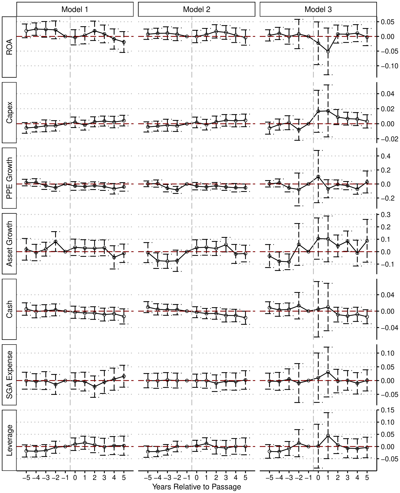

My paper, [The Dubious Impact of State Antitakeover Provisions](../../research/working_papers/antitakeover/antitakeover.pdf), is now forthcoming in the *Critical Finance Review*. The paper is long and fairly technical, so I thought I would write up a shorter, more digestible version of the argument here. The one-sentence summary: a large empirical literature claims that state antitakeover laws changed how managers run their companies, but once you analyze the data with methods that take timing seriously, there is very little evidence that these laws did anything at all — which is exactly what corporate law scholars have been saying for decades.

# Some Background

In the 1980s, hostile takeovers were everywhere — think *Barbarians at the Gate*, corporate raiders, and junk bonds. State legislatures responded by passing laws designed to make hostile takeovers harder to pull off. These "second-generation" antitakeover statutes came in several flavors (business combination laws, fair price laws, control share acquisition laws, and others), but they shared a common goal: give the managers of a target company more power to block an unwanted acquirer. Since Ohio passed the first one in 1982, 43 states have adopted at least 157 of these laws.

Why do economists care? A foundational idea in corporate finance is that the *threat* of a hostile takeover disciplines managers. If you run your company poorly, someone can buy it out from under you and replace you. Take that threat away, and — the theory goes — managers get lazy, overpay themselves and their workers, hoard cash, and avoid hard decisions. Economists call this "managerial entrenchment," and the classic paper in this literature is titled, memorably, "Enjoying the Quiet Life."

The staggered adoption of antitakeover statutes looked like a gift to empirical researchers: dozens of state laws, passed at different times, that suddenly protected some firms but not others. That is a textbook setup for a "difference-in-differences" analysis — compare the change in outcomes at protected firms to the change at unprotected firms, and you get the causal effect of entrenchment. By one count, over 80 published papers have used these laws this way, and they have found significant effects on everything from wages to innovation to leverage.

{width="85%" fig-align="center"}

# The Lawyers Object

Here is the problem. Corporate law scholars have long argued that these statutes should not matter *at all*, because of a much more powerful defense: the poison pill. A poison pill lets a target company massively dilute any hostile acquirer's stake, making a takeover prohibitively expensive. After the Delaware courts blessed the pill in 1985 (*Moran v. Household International*), any board could adopt one — and crucially, could adopt one in a single day, *after* a hostile bid showed up. Lawyers keep the paperwork sitting in a drawer.

This is the "shadow pill" argument: every firm is effectively protected by the pill it *could* adopt, whether or not it has adopted one. If the shadow pill already blocks any hostile bid, then a state law that also blocks hostile bids is legally redundant — like installing a second lock on a door that's already welded shut. In an influential article, Catan and Kahan (2016) went through several of the best-known empirical papers and showed their results fell apart due to data and design flaws, concluding that "decades of empirical studies have yielded little empirical knowledge."

The strongest response came from Karpoff and Wittry (2018) in the *Journal of Finance*. They agreed that many prior studies were flawed — you have to account for the legal and institutional context, like which other laws a firm was already covered by. But they pushed back hard on the claim that the laws are irrelevant, showing that business combination and poison pill laws remained statistically significant predictors of several firm outcomes even after adding all the institutional controls. Their paper has become the standard citation justifying continued use of these laws in empirical research.

So we were left at a standoff: the lawyers say the laws can't matter, and the empiricists keep finding that they do. My paper asks whether the empirical *methods* themselves can explain the disagreement.

# What I Do

Karpoff and Wittry generously shared their data and code, so I could start from exactly their published results and change one thing at a time. A few findings stood out.

**The headline "short vs. full model" contrast is weaker than it looks.** A centerpiece of their paper is that coefficients change once you control for institutional context. But when I bootstrap the *difference* between the two sets of coefficients, it is not statistically significant. This is the classic Gelman and Stern point: the difference between "significant" and "not significant" is not itself statistically significant.

{width="100%" fig-align="center"}

**Data quality is not the issue.** I rebuilt the dataset from scratch to fix known problems with Compustat (which backfills a firm's *current* state of incorporation into its entire history — a real problem when your treatment variable is defined by state of incorporation). Correcting the data barely changes anything. If anything, the standard regression results get slightly *stronger*. So the skeptics can't win on data-quality grounds alone; the issue runs deeper.

**Timing is the issue.** The standard approach collapses everything into a single before/after comparison. But a single "average effect" can hide wildly different patterns — including patterns that have nothing to do with the law. The figure below makes the point with a stylized example: all three columns produce the *identical* static difference-in-differences estimate. Only the first is consistent with the law causing the change. In the second, the entire difference appears *before* the law; in the third, the two groups were just on different trends all along.

{width="100%" fig-align="center"}

When I break the antitakeover estimates out by year relative to adoption — an "event study" — the timing frequently looks like columns (2) and (3), not column (1). Differences between covered and uncovered firms often show up *before* the laws pass, or don't show up at all in the window around adoption.

**Modern estimators finish the job.** There is one more technical problem, and it is a big one. A recent econometrics literature (including some of [my own earlier work](https://www.sciencedirect.com/science/article/pii/S0304405X22000204)) shows that when a policy rolls out across units at different times, the standard regression quietly uses *already-treated* firms as the comparison group for *later-treated* firms. If treatment effects change over time, this contaminates the estimate — it can shrink it, or even flip its sign. I re-estimate everything using two methods built to avoid this problem (stacked regressions and the Callaway–Sant'Anna estimator), and add formal sensitivity bounds (Rambachan–Roth) that ask whether the results would survive even modest violations of the "parallel trends" assumption.

The answer: across all fourteen combinations of outcome and statute — seven firm outcomes, for both business combination and poison pill laws — **not a single estimated effect survives**. Here is the full grid for business combination laws, the workhorse of the literature. The estimates hug zero.

{width="80%" fig-align="center"}

And here is a telling detail: the handful of results that come closest to surviving point the *wrong way*. The most robust-looking pattern is that "entrenchment" is followed by *higher* leverage — the opposite of what agency theory predicts, since debt is supposed to be a discipline device that insulated managers would shed.

# Is This Just an Underpowered Non-Result?

A fair question about any null result is whether the design simply lacked the power to detect true effects. I address this directly by computing minimum detectable effects: the designs here could reliably detect effects larger than roughly 0.05 to 0.21 standard deviations, depending on the outcome. That is adequate power for economically meaningful entrenchment effects — and none were found. What the designs *cannot* do is adjudicate effects as small as the ones in Karpoff and Wittry's full model (two to seven hundredths of a standard deviation). But if the true effects are that small, it is hard to argue these laws meaningfully changed managerial behavior — and effects of that size cannot be credibly estimated with firm-level panel data in any case.

# Why This Matters

On the narrow question, the paper supports the corporate law scholars: second-generation antitakeover statutes appear to be redundant in the shadow of the poison pill, and the large empirical literature built on them rests on a research design that does not hold up. There is also a doctrinal reason to expect exactly this. These statutes only bind transactions the target's board *doesn't* approve — and a board that wants a deal to go through can waive them, just as it can redeem a pill. It is hard to see why a defense the board can switch off at will would change how managers behave.

The broader lesson goes beyond takeover law. "Natural experiments" from staggered law adoption are everywhere in empirical finance, accounting, and legal studies, and for years the standard toolkit produced a stream of statistically significant results from this setting that, on closer inspection, aren't there. When dozens of papers find effects using a setting where the underlying legal mechanism shouldn't work, the right response is not to average the findings — it's to scrutinize the method.

None of this means corporate governance doesn't matter, or that the balance of power between managers and shareholders is unimportant. It means these particular laws are the wrong laboratory for studying it. For researchers looking for a better one, the paper's conclusion suggests a candidate: Delaware's 2025 Senate Bill 21, which shifted power back toward managers and controllers for Delaware firms, may offer a cleaner shock for the next generation of this research.

If you want the full details, the paper is [here](../../research/working_papers/antitakeover/antitakeover.pdf), and the code is on [GitHub](https://github.com/andrewchbaker/State_Antitakeover).
