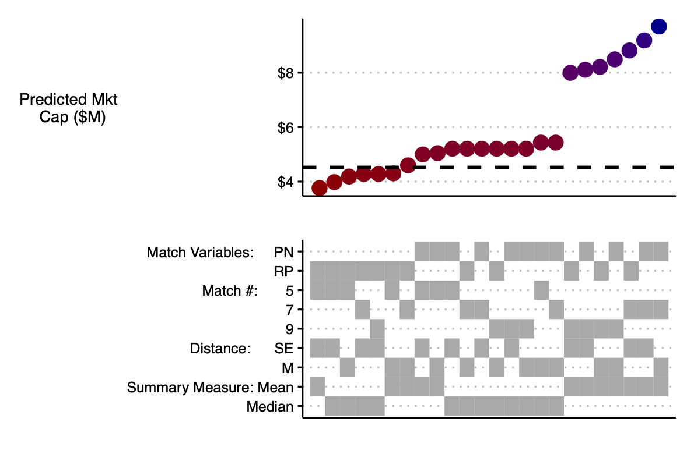
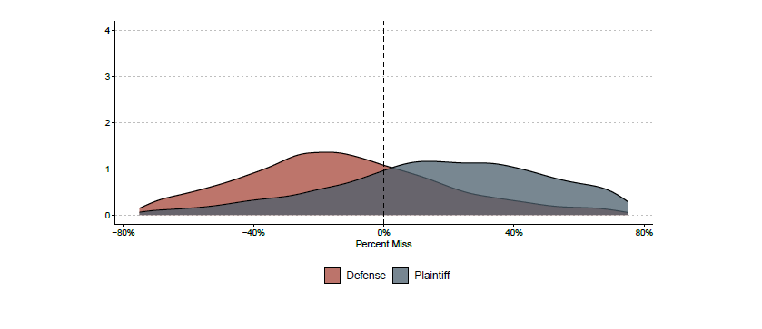
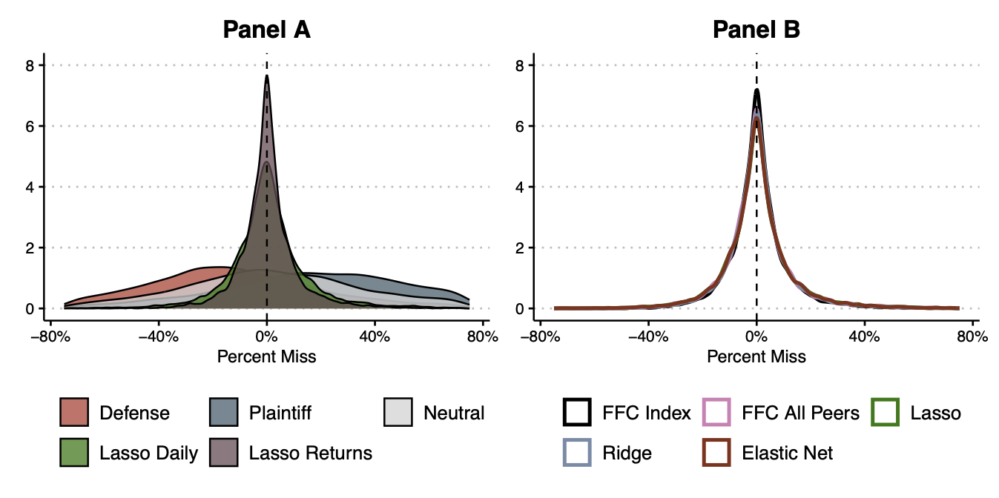

My paper with Jonah Gelbach and Eric Talley, [Validating Valuation: How Statistical Learning Can Cabin Expert Discretion in Valuation Disputes](../../research/articles/ml_comp/paper.pdf) (also on [SSRN](https://papers.ssrn.com/sol3/papers.cfm?abstract_id=4849281)), is now published in the *Journal of Corporation Law*. The one-sentence summary: the valuation methods experts use in litigation leave so much room for judgment calls that opposing experts can produce wildly different numbers while each staying squarely within textbook best practice — and simple, data-driven prediction methods can do the same job with far less room for manipulation.

# The Problem

Valuation disputes are everywhere in business litigation — appraisal actions, bankruptcy, tax, even family law — and they reliably produce a familiar spectacle: two well-credentialed experts, applying accepted methodologies to the same company, arriving at numbers that are, in the Delaware Supreme Court's words, "galaxies apart." In the *Dell* appraisal, the experts' DCF valuations diverged by about $28 billion, or 126%.

The usual explanations are bad faith or bad methods. We offer a more uncomfortable one: the methods themselves are the problem. The standard approaches — comparable companies, comparable transactions, and discounted cash flow — all require the analyst to make a series of choices that the professional literature does not pin down. Which peer firms count as comparable? How many? How do you measure similarity? Do you aggregate with the mean or the median? Each choice is individually defensible, and each moves the final number.

Our first contribution is to point out that the comparable companies and comparable transactions methods are not just *similar to* a machine-learning technique called k-nearest neighbor prediction — they *are* that technique. That framing is useful because it makes the discretionary choices explicit and countable, and because machine learning has spent decades developing tools for evaluating how well prediction methods actually predict.

# How Much Discretion Are We Talking About?

To measure it, we ran a large simulation using real data: 10,000 randomly chosen public-company-and-date targets from Compustat and CRSP, 2000–2020. For each one, we implemented the textbook comparable companies approach 24 different ways — every combination of two published sets of matching variables, three choices for the number of comps, two distance metrics, and two aggregation rules. Every one of the 24 is defensible under standard practice. Because we use real data, we also observe the firm's actual market value on the target date, so we can score every prediction against the truth.

Here is what those 24 estimates look like for one example firm, the trucking company Landstar System. The dashed line is the actually observed value, about $4.5 billion. The estimates range from $3.8 billion to $9.7 billion, and the bottom panel shows there is no simple pattern connecting the input choices to high or low values.

{width="90%" fig-align="center"}

Now imagine motivated experts. We assume the defense expert reports the second-lowest of the 24 estimates and the plaintiff's expert reports the second-highest — moderate behavior, by litigation standards. Across all 10,000 targets, the two distributions separate cleanly, with modes at roughly -25% and +25% of true value.

{width="90%" fig-align="center"}

In other words, the routine 50-percentage-point gaps that courts see between opposing experts don't require anyone to cheat. The discretion built into the conventional method is enough to produce them on its own. And a "neutral" fix within the method — taking the median across parameterizations — turns out to be unbiased but very noisy: roughly a quarter of those median predictions miss the true value by more than 40%.

# The Fix

Our second contribution is constructive. Using the same raw data an expert doing comparable companies analysis would already have, we let the data make the choices instead: which peers matter, how much weight each gets, and how to combine them. We do this with penalized regression (lasso, ridge, and elastic net) — familiar, transparent methods whose fitting procedure is observable and replicable by anyone, including the other side and the judge.

We work through a sequence of increasingly aggressive refinements, and each step helps:

1. **Use time series information.** Regress the target firm's valuation ratio on its peers' ratios over the prior eight quarters, in the spirit of synthetic controls. This alone beats the neutral k-NN estimate.
2. **Target market cap directly.** The valuation ratio is just a middleman; predicting the thing you actually care about reduces noise further.
3. **Use daily data.** Market cap is observable every trading day, and more data helps.
4. **Predict returns, not levels.** The biggest gains come from modeling daily stock *returns* with a standard factor model plus peer returns, then cumulating predicted returns into a valuation — the same modeling tradition used in securities fraud event studies.

The picture below summarizes the endpoint. The wide red and blue humps are the simulated defense and plaintiff experts from before; the tall spike is the returns-based lasso model. The data-driven predictions are approximately unbiased and dramatically less variable — which means dramatically less room for an expert to push the number where a client wants it.

{width="100%" fig-align="center"}

# A DFC Global Do-Over

The paper closes by applying these methods to a real case: the *DFC Global* appraisal, one of Delaware's most-watched valuation fights. In the actual litigation, the petitioners' expert valued the payday lender at $17.90 per share; the respondent's expert said $7.94. Chancellor Bouchard split the difference across three methods and arrived at $10.21.

Running our approaches on the case data, our estimates range from about $8 to about $13 per share — a much narrower band than the experts produced. Our preferred method, the daily returns approach (the best performer in the simulations), lands in the neighborhood of $10 per share — coincidentally, about where the court ended up after 68 pages of effort.

# Does the Cure Repeat the Disease?

A fair objection: if experts can choose among ML models, haven't we just relocated the discretion? Partly, but two things blunt the concern. First, the data-driven approaches simply produce less dispersed estimates, so even a motivated expert has less to work with. Second, and more importantly, statistical models come with a discipline conventional methods lack: measurable predictive performance. A judge can require each expert to report how well their model predicts out of sample — a replicable number, computed by an observable procedure — and credit the model that predicts better. That question ("does your method actually predict values well?") is one courts almost never ask today, and it is the question the whole enterprise should turn on.

The full paper — including the valuation methodology background, the formal setup, and the DFC analysis in detail — is [here](../../research/articles/ml_comp/paper.pdf).
