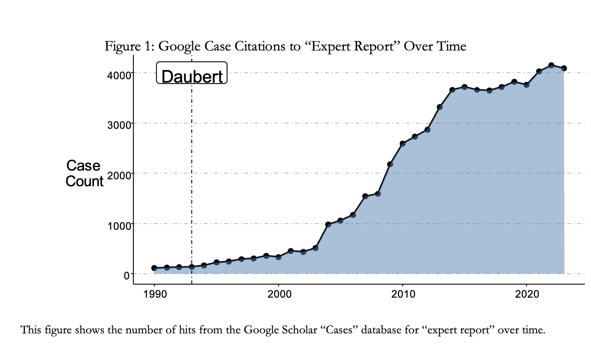

## Links

-   [Paper](Statistical%20Learning%20BBLJ.pdf)

## Abstract

This article examines the historical challenges of expert testimony in the American legal system and proposes a forward-looking reform grounded in modern statistical learning techniques. Tracing the evolution from court-appointed experts to partisan witnesses, the paper highlights how adversarial practices and scientific complexity have strained judicial gatekeeping, particularly under the Daubert standard of judicial review of expert testimony. The paper argues that shifting from traditional model-driven estimation methods to data-driven, algorithmic approaches can improve the reliability and transparency of expert evidence. Through empirical examples in securities litigation and corporate valuation, it demonstrates how statistical learning methods can reduce expert discretion and aid judicial decision-making. The proposed reforms offer a practical pathway for courts to enhance the quality and fairness of expert testimony in modern litigation.

## Important figure

This figure shows the number of hits from the Google Scholar "Cases" database for "expert report" over time.

