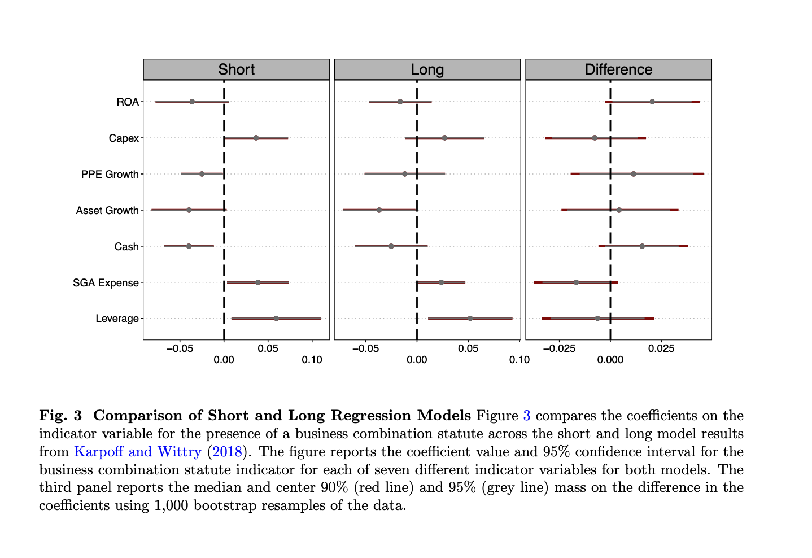

## Links

-   [Paper](antitakeover.pdf)
-   [Code](https://github.com/andrewchbaker/State_Antitakeover)

## Abstract

Corporate governance scholars have engaged in a longstanding debate over the impact of state antitakeover provisions. Corporate law practitioners and researchers argue that the affirmation of the "poison pill" made the second generation of antitakeover statutes redundant, while empirical scholars in corporate finance continue to find wide-ranging impacts from their adoption. This paper subjects the standard approach used in the empirical literature to a series of straightforward extensions using current best practice in panel data analysis. Contrary to the majority of published research, there is scant evidence for a consistent and reliable impact of antitakeover statute adoption on firm activity. These findings follow logically from the legal argument that takeover statutes provide little additional takeover deterrence in the presence of a "shadow pill."

## Important figure

