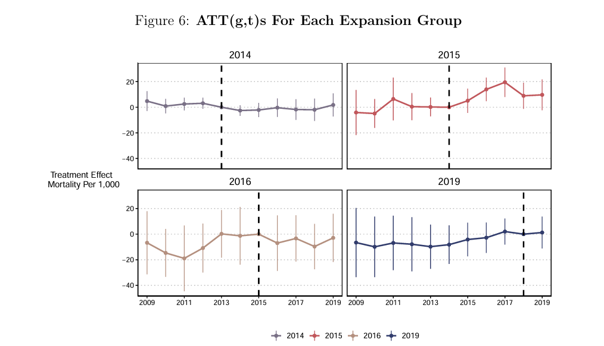

## Links

-   [Arxiv](https://arxiv.org/pdf/2503.13323)

## Abstract

Difference-in-Differences (DiD) is arguably the most popular quasi-experimental research design. Its canonical form, with two groups and two periods, is well-understood. However, empirical practices can be ad hoc when researchers go beyond that simple case. This article provides an organizing framework for discussing different types of DiD designs and their associated DiD estimators. It discusses covariates, weights, handling multiple periods, and staggered treatments. The organizational framework, however, applies to other extensions of DiD methods as well.

## Important figure

This figure shows the group-time ATT estimates (ATT(g, t)) in calendar time for the four treatment timing groups of counties that expanded Medicaid before 2019, using not-yet-treated units as the comparison group, and their uniform confidence intervals at the 95% significance level. The outcome variable is the crude mortality rate for adults ages 20-64, and standard errors are clustered at the county level. The vertical line represents the year before Medicaid expansion (i.e., $g- 1$) for the timing group.

